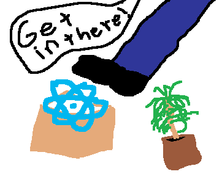

# 

[![NPM version][npm-image]][npm-url]
[![Dependency Status][dep-image]][dep-url]
[![js-standard-style][standard-image]][standard-url]

One command to build your React frontend.

## Features

- Unified package, only one `npm i` needed.
- Linting with your `.eslintrc` or with `standard`.
- ES6 with Babel presets `react`, `es2015` and `stage-0`.
- PostCSS with `precss` and `autoprefixer`.
- Style extraction into dedicated css bundle.
- Include enviroment variables with an `.env.js` file.
- Automatic index.html creation with `html-webpack-plugin`.
- Source maps for styles and scripts.
- Watch mode (`--watch`).
- Development server mode (`--dev`).
- Toggle optimizations with `uglify` and `cssnano` (`-O`).

## Table of Contents

  * [Features](#features)
  * [Install](#install)
  * [Example](#example)
  * [FAQ](#faq)
    * [How do I use another linter than `standard`?](#how-do-i-use-another-linter-than-standard)
    * [How do I customize index.html?](#how-do-i-customize-indexhtml)
  * [CLI](#cli)
  * [Tested on](#tested-on)
  * [Contributors](#contributors)

## Install

```
$ npm i reactpack -g
```

or for use in `scripts` section of `package.json`

```
$ npm i reactpack --save-dev
```

## Example

```js
import React, { Component } from 'react'
import { render } from 'react-dom'

require('bootstrap/dist/css/bootstrap.css')

class Example extends Component {
  render () {
    return <h1>Hello World!</h1>
  }
}

render(<Example />, document.getElementById('react-app'))
```

```javascript
{
  ...
  "scripts": {
    "build": "reactpack src/index.js",
  },
  "dependencies": {
    "bootstrap": "^3.3.6",
    "react": "^15.1.0",
    "react-dom": "^15.1.0",
  },
  "devDependencies": {
    "reactpack": "^0.2.0"
  },
  ...
}
```

<p align="center">
  
</p>

## FAQ

##### How do I use another linter than `standard`?

`reactpack` will look for an eslint config (`.eslintrc`, `.eslintrc.json` ...) and if one is present
it will use that one. Make sure that you have all the dependencies installed (plugins etc) to run your linter.

##### How do I customize index.html?

Place an `index.ejs` file in the same directory as your entry script and `reactpack` will use it
for generating html. The default `index.ejs` looks like:

```html
<!DOCTYPE html>
<html>
  <head>
    <meta http-equiv="Content-type" content="text/html; charset=utf-8"/>
    <title><%= htmlWebpackPlugin.options.title %></title>
    <% if (htmlWebpackPlugin.options.dev) { %>
    <script src="http://localhost:<%= htmlWebpackPlugin.options.port %>/webpack-dev-server.js"></script>
    <% } %>
  </head>
  <body>
    <div id="react-app"></div>
  </body>
</html>
```

## CLI

```
  Usage: reactpack [options] <entry> [path/to/bundle]

  Options:

    -h, --help         output usage information
    -V, --version      output the version number
    -q, --quiet        no output
    -O, --optimize     optimize css and js using minifiers
    -w, --watch        watch mode, rebuild bundle on file changes
    -d, --dev          start a dev server with hot module replacement
    -p, --port <port>  port for dev server (default is 8000)
    --standard         force standard linting (do not look for eslint config)
    --clean            delete everything in bundle path before building
    --no-source-map    don't output source maps for css and js
    --no-postcss       don't use postcss (autoprefixer and precss)
    --no-html          don't output an index.html
    --no-extract       don't extract css into separate bundle
    --no-lint          turn off linting
    --no-env           don't try and load .env.js file
```

## Tested on

- Windows 7 with node 6 and npm 3
- Ubuntu 12.04 with node 6 and npm 3

## Contributors

* Ola Holmström (@olahol)
* Tarjei Huse (@tarjei)
* Code Hz (@codehz)
* Erik Huisman (@erikhuisman)

[npm-image]: https://img.shields.io/npm/v/reactpack.svg
[npm-url]: https://npmjs.org/package/reactpack
[dep-image]: https://david-dm.org/olahol/reactpack/status.svg
[dep-url]: https://david-dm.org/olahol/reactpack
[standard-image]: https://img.shields.io/badge/code%20style-standard-brightgreen.svg
[standard-url]: https://github.com/feross/standard
